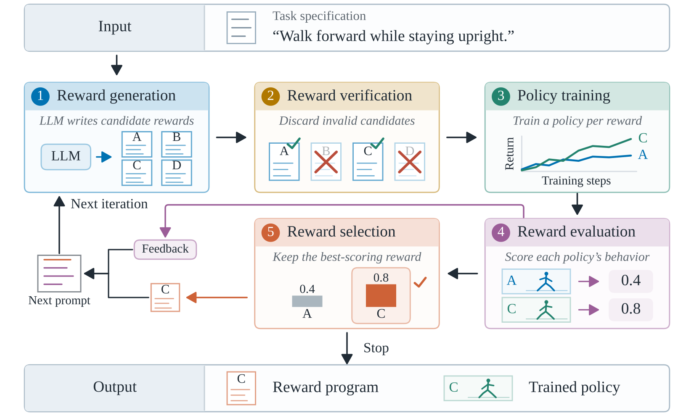
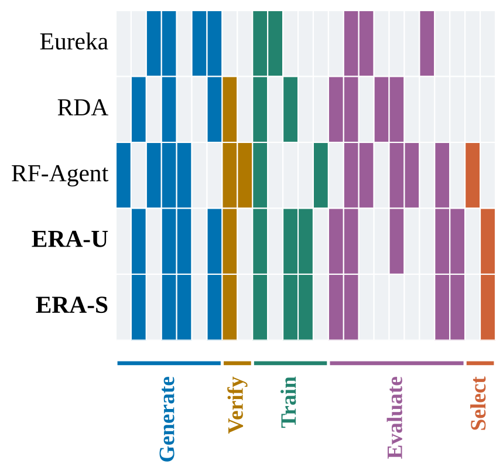
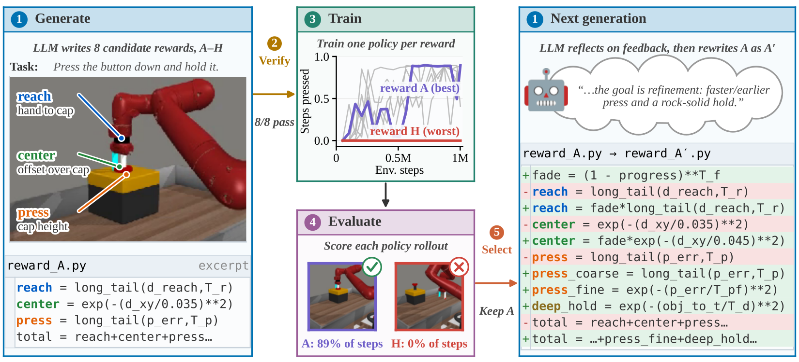
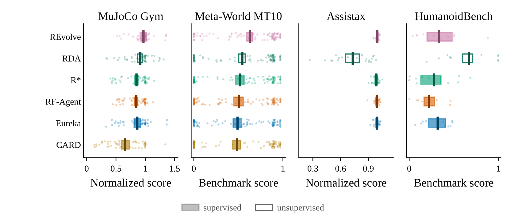
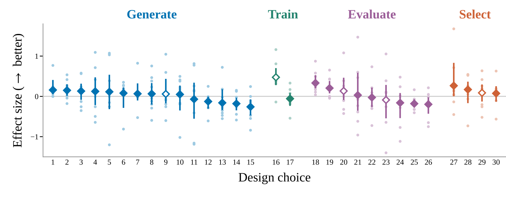
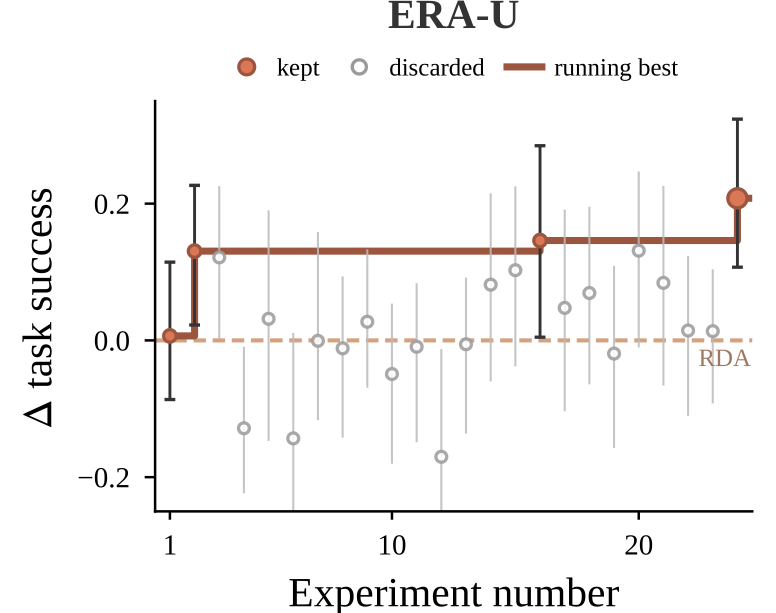
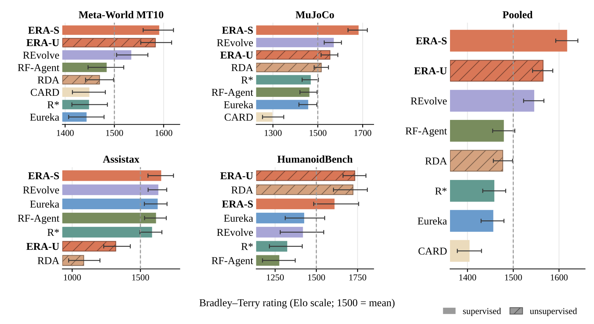

# BIRD: A Benchmark for Iterative Reward Design

Code for **A Bird's-Eye View of Iterative Reward Design**<br>
Logan M. Bhamidipaty<sup>1,2</sup>\*, Lauren Robson<sup>1</sup>\*, Linda Petrini<sup>3</sup>,
Shengrui Lyu<sup>3</sup>, Kamal Ndousse<sup>3</sup><br>
<sup>1</sup>Anthropic Fellows Program · <sup>2</sup>University of Edinburgh · <sup>3</sup>Anthropic<br>
(\*equal contribution) · Contact: l.m.bhamidipaty@sms.ed.ac.uk

[Paper (arXiv, coming soon)](#citation) · [Quickstart](#quickstart) · [Methods](#methods) ·
[Reproducing the paper](#reproducing-the-paper) · [Citation](#citation)

<p align="center">
  
</p>

*Most iterative reward design methods follow the same loop: an LLM writes candidate
rewards, invalid ones are discarded, a policy is trained under each survivor, the
policies are evaluated, the best reward is selected, and feedback seeds the next round.*

Iterative reward design (IRD) methods such as Eureka, Text2Reward and their successors
automate reward engineering with LLMs, but they are hard to compare: each paper has its own
implementation, model backbone, feedback assumptions, training budget and environments.
BIRD implements the IRD loop **once**, as six configurable stages, and expresses each
published method as a **configuration** of that loop. Methods that share a design choice
share its implementation, so you can

- **compare** methods under matched feedback conditions and policy-training budgets,
- **ablate** a single design choice by changing one configuration key, and
- **assemble** new methods from existing components.

**What the paper finds** (details in the paper):

- Under matched conditions the published methods perform surprisingly similarly;
  REvolve is the strongest overall.
- Of 30 design choices we ablated, most show no clear benefit across tasks and methods;
  a few simple ones help consistently.
- A small hill-climb that starts from RDA and changes one design choice at a time produces
  two recipes, **ERA-U** (unsupervised) and **ERA-S** (supervised), which rank first and
  second overall.
- Higher benchmark scores do not guarantee the intended behavior: a small human study
  finds high-scoring policies that are unnatural or even harmful.

## Methods as configurations

<p align="center">
  
</p>

*Each row is a method and each column a configuration key, grouped by stage; colored cells
are keys the method sets, gray cells are BIRD defaults. ERA-U and ERA-S use RDA's
configuration as a backbone.*

A configuration is a short YAML file of design choices, and two methods differ exactly in
the keys on which their configurations differ:

```console
$ uv run python3 bird.py --diff era_u era_s
2 key(s) differ between era_u and era_s:

  evaluate.fitness.source                   'vlm_score'  ->  'native'
  name                                          'era_u'  ->  'era_s'
```

<p align="center">
  
</p>

*One iteration of Eureka on Meta-World's button-press task, from an actual run. The LLM
writes eight rewards, a PPO policy is trained under each, Eureka keeps the best (A, 89%
task success) and uses feedback on its reward components to revise it into A′.*

## Results

<p align="center">
  
</p>

*Six published methods on MuJoCo, Meta-World MT10, Assistax and HumanoidBench under
matched policy-training budgets. Each dot is one seed on one task; ticks are means and
bars 95% BCa bootstrap intervals.*

<p align="center">
  
</p>

*Effect (Glass's Δ) of enabling each of 30 design choices across the applicable baselines
(Eureka, RDA, CARD) on nine tasks. Hollow diamonds are choices introduced in BIRD. Only
four clearly help: (16) the peak own-reward checkpoint, (18) summarized feedback,
(19) task-success fitness and (1) four-turn history.*

<table>
<tr>
<td width="42%" valign="top">

<br><em>Hill-climbing from RDA on four unsaturated MT10 tasks: 24 configurations, stopping
at +0.21 task success over RDA. The result is ERA-U.</em>
</td>
<td width="58%" valign="top">

<br><em>Bradley–Terry ratings per benchmark and pooled over 21 tasks. ERA-S and ERA-U rank
first and second overall; hatched bars are unsupervised methods.</em>
</td>
</tr>
</table>

## Installation

BIRD uses [uv](https://docs.astral.sh/uv/). The core depends only on `pyyaml` and `numpy`;
everything else is an optional extra, imported only by the code path that needs it.
`uv sync` installs exactly the extras it is given (and removes any others), so name every
extra you need in one command:

```bash
uv sync --extra test                                   # core + tests: runs fully offline
uv sync --extra test --extra metaworld --extra sb3 --extra anthropic --extra video
                                                       # + Meta-World MT10 and Gym MuJoCo with SB3 PPO,
                                                       #   Claude as generator / judge, mp4 recording
```

Runs that call Claude need `ANTHROPIC_API_KEY` in the environment.

HumanoidBench and Assistax pin simulator versions that cannot share one environment with
Meta-World, so each has its own setup script and virtual environment
(`.venv-humanoid`, `.venv-jax`); see [GPU benchmarks](#gpu-benchmarks-humanoidbench-and-assistax).

Methods judged by a vision-language model render MuJoCo frames, which needs an EGL or
OSMesa library. On a machine without one, run `bash scripts/setup_gl.sh` once (it installs
Mesa into `~/.local/opt/gl`), then `source scripts/setup_gl.sh --env` in each shell that
renders.

## Quickstart

Every command below runs offline. The `tester` profile swaps in a mock LLM, a toy
environment and a mock learner, so a whole search finishes in about a second.

```bash
uv run python3 bird.py --list-configs                      # every configuration, by directory
uv run python3 bird.py -c eureka --profile tester          # run Eureka end to end, offline
uv run python3 bird.py -c rda --print-config               # the fully resolved configuration
uv run python3 bird.py --diff eureka rda                   # the keys on which two methods differ
uv run python3 bird.py -c eureka -s generate.n_candidates=4 -s seed=7 --dry-run
uv run python3 -m pytest tests -q
```

Each run writes `runs/<name>-<config hash>-<timestamp>/` containing the fully resolved
configuration, every candidate reward, its training curve and evaluation, the prompts
and responses, and the returned reward.

### How configurations work

Every key is declared in `configs/_default.yaml` (with its default) and in
`bird/schema.py` (with its allowed values). Unknown keys are errors, and every value that
names an implementation is a key in the component registry (`bird/registry.py`), so a
configuration cannot select something that does not exist.

- `extends:` inherits from another configuration; lists replace rather than append.
- `--profile` layers an execution profile (`tester`, `dev`, `full`) on top of the method
  (order: defaults, `extends:` chain, method file, profile, `-s` overrides). A profile may
  set only execution keys (models, budgets, backend, parallelism, tracking, video), so it
  changes *how expensively* a run executes, never *which method* it is.
- `-s key=value` overrides any key on the command line.
- `-c` takes a file path, a path relative to `configs/` (`methods/eureka`,
  `hillclimb/v2_verify`), or a bare name (`eureka`, `era_u`, `v2_verify`); a bare name
  must match exactly one file under `configs/` (outside `_profiles/`), and an ambiguous
  one is refused.
- The resolved configuration is written with every run, and its hash is the run id.

## Methods

| Method | Configuration (`configs/methods/`) |
|---|---|
| Optimal Reward Search (Singh et al., 2009)† | `singh_orp` |
| Language to Rewards (Yu et al., 2023)† | `l2r` |
| Eureka (Ma et al., 2024) | `eureka` (published ablation: `eureka_no_evolution`) |
| Text2Reward (Xie et al., 2024) | `text2reward_zeroshot`, `text2reward_human`, `metaworld_text2reward_zeroshot` |
| DrEureka (Ma et al., 2024) | `dreureka` |
| REvolve (Hazra et al., 2025) | `revolve` |
| CARD (Sun et al., 2025) | `card` (five-iteration protocol: `card_iter5`) |
| RF-Agent (Gao et al., 2025) | `rf_agent` |
| R\* (Li et al., 2025) | `rstar` |
| ROSKA (Huang et al., 2025) | `roska` |
| LaRes (Li et al., 2025) | `lares` |
| Gran Turismo (Ma et al., 2025) | `gt` |
| RDA (Lee et al., 2026) | `rda` (HumanoidBench setting: `rda_humanoidbench`) |
| LIMEN (Jaswal et al., 2026) | `limen`, `limen_reward_only` |
| **ERA-U** (this paper) | `configs/era_u.yaml` |
| **ERA-S** (this paper) | `configs/era_s.yaml` |

† Included in simplified form (see the paper's appendix).

Each method file holds the values its paper and released code specify, with a short
citation for each; † marks a value where the paper and the released code disagree, ‡ a
value the paper leaves unspecified. Most are not runnable as written (they name retired
models or budgets of hundreds of millions of steps); the paper's experiments run them
under a matched protocol, described next.

`configs/hillclimb/` holds the 24 configurations of the hill-climb behind ERA-U (plus four
parents in their inheritance chain), named as in the paper's hill-climb table (`v1`,
`v2_verify`, ..., `v4_peak_noes40`); `era_u.yaml` is configuration 24 under its paper name.

## Reproducing the paper

The paper runs every method under one protocol: eight candidates per iteration, five
iterations, 1M environment steps per policy training (20M on Assistax), one RL optimizer
per benchmark, `claude-opus-5` as the reward generator and vision-language judge, and
`claude-sonnet-5` for secondary evaluator roles. `scripts/paper_cell.py` turns a (method,
task, seed) triple into the exact command:

```bash
uv run python3 scripts/paper_cell.py --list                                   # methods and the 21 tasks
uv run python3 scripts/paper_cell.py --method era_u --task mt10_push-v3 --seed 0          # print the command
uv run python3 scripts/paper_cell.py --method era_u --task mt10_push-v3 --seed 0 --dry-run
uv run python3 scripts/paper_cell.py --method eureka --task gym_hopper_hop --seed 0 --run
```

| Benchmark | Tasks | Learner | Seeds |
|---|---|---|---|
| Meta-World MT10 (v3) | 10 | Stable-Baselines3 PPO, CPU | 10 |
| Gym MuJoCo (v5) | 5 | Stable-Baselines3 PPO, CPU | 10 |
| Assistax | 4 | Assistax's IPPO in JAX, one GPU, 20M steps | 5 |
| HumanoidBench | 2 | FastTD3 with SimbaV2 networks, one GPU | 5 |

A search trains 40 policies (RF-Agent 38; CARD, which trains one candidate per iteration,
4). REvolve runs 13 islands, as its configuration specifies, except on HumanoidBench,
where the paper's runs used 3 (`paper_cell.py` sets this). As a rough guide from the
paper's runs: a Meta-World or Gym MuJoCo search takes 3–6 hours on 8 CPU cores, an
Assistax search about 8 GPU-hours and a HumanoidBench search about a day of GPU time; a
search makes on the order of a hundred LLM calls (more for methods with an in-loop
vision-language judge).

`paper_cell.py` covers the method comparison and the hill-climb. The ablation study, the
candidate-allocation sweep and the EPIC analysis are configurations of the same loop; the
keys each one varies are listed in the paper's appendix.

### GPU benchmarks: HumanoidBench and Assistax

Both run from their own virtual environment, and `paper_cell.py` prints commands that use
it. Run `--run` with that environment's interpreter.

```bash
# HumanoidBench: mujoco 3.1.6, humanoid-bench @ cb118903; the paper's cells need CUDA torch
TORCH_INDEX=https://download.pytorch.org/whl/cu128 bash scripts/setup_humanoid.sh
.venv-humanoid/bin/python scripts/paper_cell.py --method era_u --task h1hand_walk --seed 0 --run

# Assistax: JAX, assistax @ a7d94f4e, and the benchmark's zoo of 630 pretrained human partners
bash scripts/setup_jax.sh
hf download leohink/assistax-zoo zoo.tar.gz --repo-type dataset --local-dir ~/assistax-zoo
tar -xzf ~/assistax-zoo/zoo.tar.gz -C ~/assistax-zoo
export BIRD_ZOO_PATH=~/assistax-zoo/zoo
.venv-jax/bin/python scripts/paper_cell.py --method era_u --task upstream_assistax_feeding --seed 0 --run
```

The zoo's contents are checked against a recorded digest before training.

### Differences from the code that produced the paper's numbers

The paper's runs were made at several commits of our development repository. This release
includes bug fixes made since then, and its prompts differ in three ways:

- the environment description given to the generator now ends with an index of the
  observation fields; the Meta-World, Gym MuJoCo and HumanoidBench runs predate it;
- for HumanoidBench and Assistax the environment description includes source code from
  this repository's adapters, whose comments were edited for this release;
- the CARD and REvolve configurations gained fidelity fixes after the paper's runs.
  `scripts/paper_cell.py --protocol paper` (the default) restores the settings CARD's runs
  used; REvolve's environment description (a Pythonic class abstraction in the
  Meta-World, Gym MuJoCo and HumanoidBench runs) is now natural-language only and cannot
  be restored by an override. `--protocol current` uses the configurations as they are
  (CARD still trains with PPO's default hyperparameters on Meta-World and Gym MuJoCo,
  since its SAC block does not apply to PPO).

## Reward hacking on HumanoidBench

`policies/h1hand_hb_hacks/` contains the scripted policies from the paper's Section 4.4:
`moonhop` and `crawl_rock` reach high reference reward on HumanoidBench walk and crawl by
hopping facing backward or rocking in place, which shows that those reference rewards can
be maximized without walking or crawling. The directory also holds `hop`, a supplementary
example (a two-footed forward hop that clears the walk bar the same way). Evaluate them
with `scripts/eval_policy.py`.

## Repository layout

```
bird.py              the IRD loop and the command-line interface
bird/                config system, registry, components for each stage, LLM clients
bird/envs/           environment adapters (Meta-World, Gym MuJoCo, Assistax, HumanoidBench, toy)
configs/             configurations
  _default.yaml      every key and its default
  methods/           the published methods, their variants, and zeroshot (the root they extend)
  era_u.yaml         ERA-U, the paper's unsupervised recipe
  era_s.yaml         ERA-S, the paper's supervised recipe
  hillclimb/         the hill-climb configurations behind ERA-U
  examples/          a small illustrative configuration (the JAX reward path)
  _profiles/         execution profiles (tester, dev, full, and two for HumanoidBench)
tasks/               one task specification per environment (description, horizon, metric)
policies/            scripted policies (Meta-World policies used by the hill-climb's demonstration verifier;
                     HumanoidBench reward-hacking policies; controllers for the toy and classic-control
                     tasks, used by the tests)
scripts/             setup scripts, the paper protocol, spec generators, utilities
tests/               the test suite
docs/figures/        the figures in this README
licenses/            license texts of the third-party works listed in THIRD_PARTY_NOTICES.md
```

## Tests

```bash
uv run python3 -m pytest tests -q
```

Tests that need an optional dependency (a simulator, a learner, an API key) skip when it
is absent, so the suite passes under `--extra test` alone; install the corresponding extras
to run them. Tests that render frames are the exception: they carry the `gl` marker and
fail rather than skip when a simulator is installed but no GL library is, so either set one
up (`scripts/setup_gl.sh`, see [Installation](#installation)) or deselect them with
`-m "not gl"`. `-m "not slow"` runs the fast offline subset.

## Citation

```bibtex
@article{bhamidipaty2026bird,
  title   = {A Bird's-Eye View of Iterative Reward Design},
  author  = {Bhamidipaty, Logan M. and Robson, Lauren and Petrini, Linda and
             Lyu, Shengrui and Ndousse, Kamal},
  journal = {arXiv preprint arXiv:XXXX.XXXXX},
  year    = {2026}
}
```

## Acknowledgments

This work was done as part of the Anthropic Fellows Program.

## License

MIT (see `LICENSE`). BIRD contains code, assets and prompt text derived from third-party
works under their own licenses; see `THIRD_PARTY_NOTICES.md` and `licenses/`.
